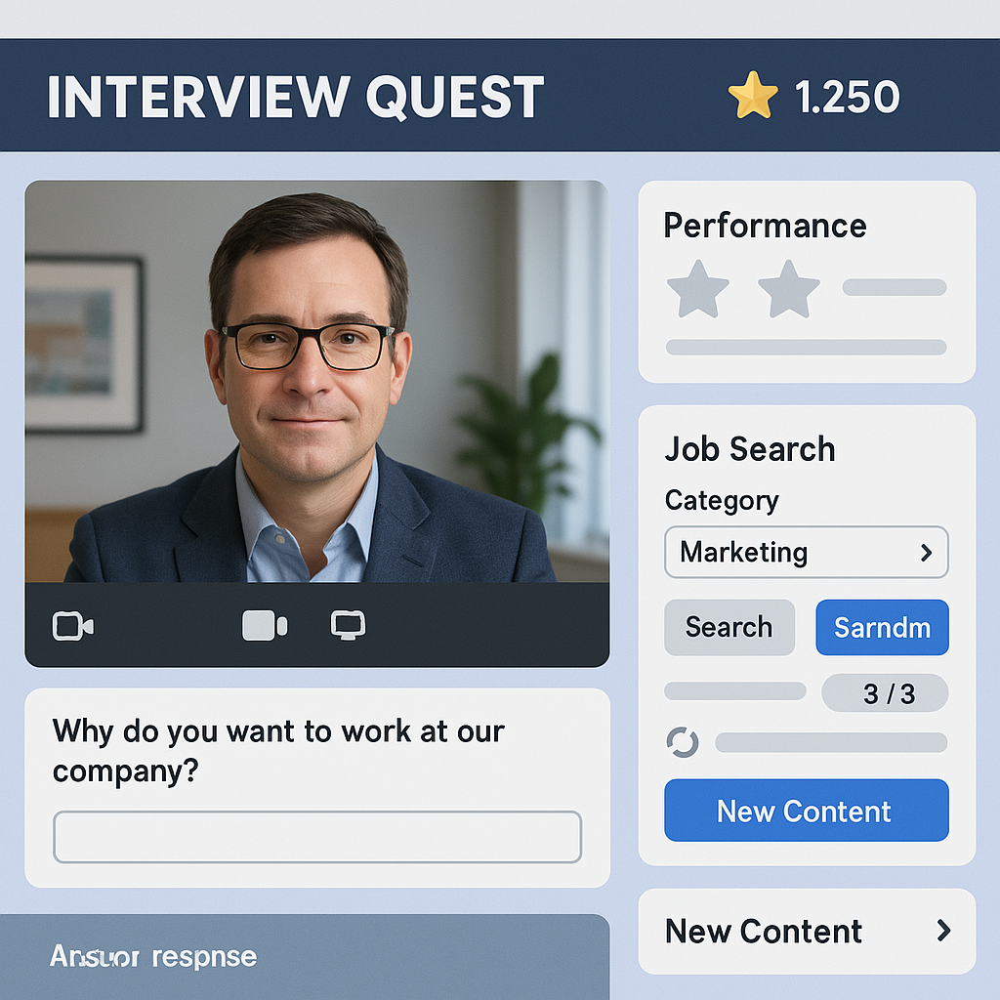

# **Job Interview Simulator Game Design**

## **Game Description**
Interview Quest is a skill-building game where players participate in simulated job interviews with AI-generated interviewers. Players can search for specific jobs or generate random job opportunities with a limited number of rerolls. During interviews, players answer questions from distinct "bosses" created using face generation technology (like thispersondoesnotexist.com), with their performance determining whether they get "hired" and how many "stars" they earn. Stars function as the in-game currency for purchasing cosmetic skins and add-ons, as well as additional rerolls for interviewers if players exhaust their free allotment within a time limit.

## **Problem Definition and User Research**

### **Problem:**
Job interviews cause anxiety and stress for many people, yet there are limited opportunities to practice in realistic scenarios without real consequences. Interview Quest addresses this gap by providing a game-based environment where users can develop interview skills through repeated practice with AI interviewers.

### **Target Audience:**
* Jobseekers looking to improve interview skills
* Students preparing to enter the workforce
* Kids wanting to play an educational/practical game 

### **User Scenario:** 
A recent graduate named Jamie feels nervous about upcoming job interviews. With Interview Quest, Jamie can practice with AI interviewers that simulate different personality types and question styles, building confidence before real interviews.

## **Conceptualization and Design**

### **Main Features:**
* AI-generated interviewer faces for video call simulation
* Searchable job database with random generation option
* Performance-based star reward system
* Customization options purchased with earned stars

### **Game Interface Details:**
* Video call layout showing the AI interviewer
* Response input area for player answers
* Performance metrics display showing progress
* Job search interface with filters and random generation

### **Progression Flow:**
1. Select job category through search or random generation
2. Meet the "boss" interviewer for that position
3. Answer interview questions to demonstrate skills
4. Receive performance assessment and star rewards
5. Use stars to unlock new content or cosmetic items

## **Behaviors**

### **Key Engagement Mechanisms:**
* Limited daily rerolls create strategic decision-making
* Visual feedback from interviewers based on answer quality
* Star currency system provides tangible progress metric
* Timer-based reroll regeneration encourages regular play
* Varied interviewer personalities require adaptive responses

## **Deployment and Maintenance**

### **Deployment Strategy:**
* Mobile and web platforms for accessibility
* Free core experience with optional cosmetic purchases
* Regular updates with new job types and interview questions

### **Maintenance Plan:**
* Weekly refresh of featured job listings
* Monthly addition of new interviewer personalities
* Quarterly update of question database to reflect current trends
* Ongoing refinement of AI response assessment algorithms